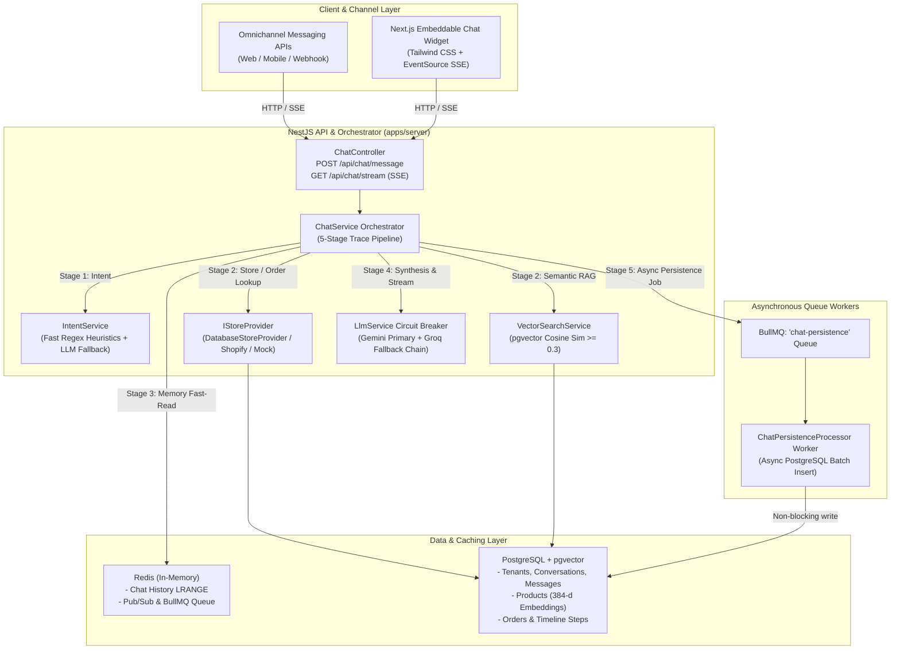
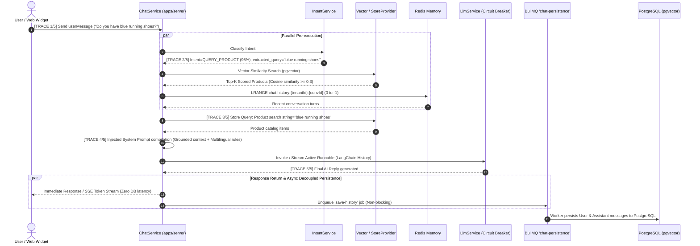
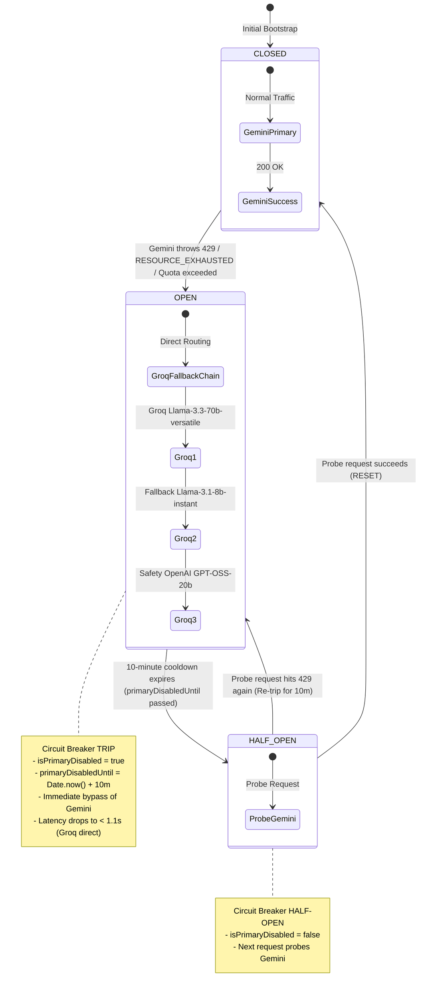
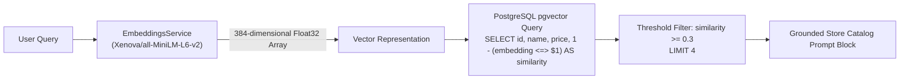
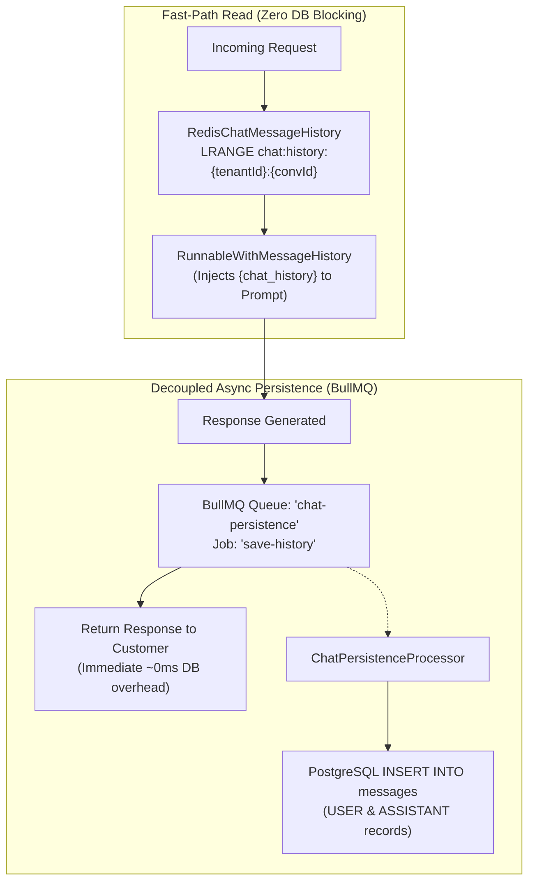
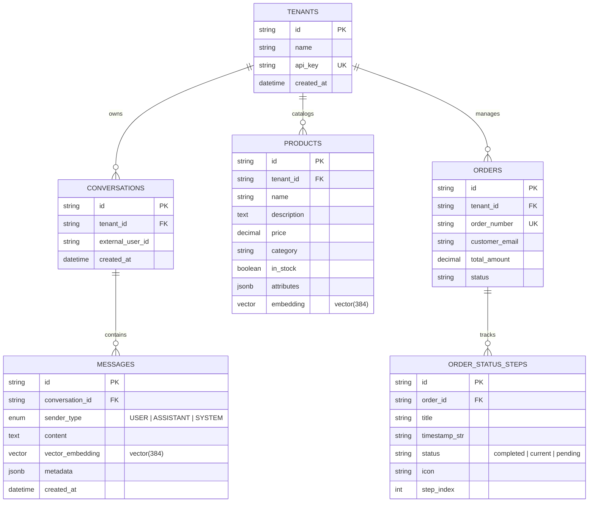

# Omnichannel Commerce AI — Project Flow & System Architecture

This document provides a comprehensive, end-to-end technical reference and lifecycle flow diagram for the **Omnichannel Commerce AI Engine**.

---

## 1. High-Level Architecture Overview



---

## 2. End-to-End User Text Lifecycle (5-Stage Trace Pipeline)

Every incoming customer message passes through 5 distinct pipeline stages:



### Trace Logging Specification

| Stage Marker | Component | Description |
| :--- | :--- | :--- |
| `[TRACE: 1/5]` | `ChatService.processMessage` | Exact incoming raw `userMessage`, `tenantId`, and `conversationId`. |
| `[TRACE: 2/5]` | `IntentService.classifyIntent` | Detected `intent`, `confidence`, and `extracted_query`. |
| `[TRACE: 3/5]` | `ChatService.prepareContext` | Exact search string or order lookup identifier dispatched to store provider. |
| `[TRACE: 4/5]` | `ChatService.prepareContext` | Full compiled system prompt bracketed between `--- SYSTEM PROMPT START ---` and `--- SYSTEM PROMPT END ---`. |
| `[TRACE: 5/5]` | `ChatService` | Final generated AI response string before enqueuing persistence. |

---

## 3. Resilient LLM Circuit Breaker & Fallback Chain

`LlmService` features an **In-Memory Circuit Breaker Pattern** with **Half-Open Auto-Recovery** to prevent latency spikes during Gemini rate-limiting (`429` / `RESOURCE_EXHAUSTED`):



### Model Hierarchy

```
Primary:
└── ChatGoogleGenerativeAI (gemini-3.6-flash, temperature: 0.3)
    │
    ▼ (On 429 or Failover)
Fallback Chain:
├── ChatGroq (llama-3.3-70b-versatile, temperature: 0.3)
├── ChatGroq (llama-3.1-8b-instant, temperature: 0.3)
└── ChatGroq (openai/gpt-oss-20b, temperature: 0.3)
```

---

## 4. Intent Classification Engine

`IntentService` applies a two-tier classification architecture:

1. **Sub-millisecond Heuristic Fast-Path (`< 1ms`)**:
   - `GREETING`: Regex matches multilingual salutations (English, Burmese `မင်္ဂလာပါ`, Thai `สวัสดี`, `thx`, etc.).
   - `CHECK_ORDER`: Regex pattern matching tracking keywords and order IDs (`#ORD-12345`, `[0-9]{4,8}`).
   - `ADD_TO_CART`: Regex patterns matching checkout and bag keywords (`add ... to cart`, `buy ...`).
   - `QUERY_PRODUCT`: Common commerce keywords (`shoes`, `sneakers`, `hoodie`, `price of ...`).

2. **LLM Structured JSON Fallback (`~200-400ms`)**:
   - For ambiguous queries, invokes LLM with strict JSON schema output:
   ```json
   {
     "intent": "QUERY_PRODUCT",
     "confidence": 0.96,
     "extracted_query": "running shoes or headphones"
   }
   ```

---

## 5. Semantic Vector RAG & Store Catalog Integration



---

## 6. Multi-Turn Conversation Memory Architecture



---

## 7. Multilingual Grounding System

The assistant dynamically adapts tone, vocabulary, and polite particles while maintaining exact product IDs, numeric prices, and attributes:

- **English**: Natural, concise, friendly commerce assistant.
- **Burmese (မြန်မာဘာသာ)**: Natural Burmese with polite particles (`ခင်ဗျာ` / `ရှင့်`).
- **Thai (ภาษาไทย)**: Polite Thai with standard conversational particles (`ค่ะ` / `ครับ`).

---

## 8. Database Schema Overview (`PostgreSQL + pgvector`)



---

## 9. API Reference & Verification Commands

### Endpoints

| Method | Path | Description |
| :--- | :--- | :--- |
| `POST` | `/api/chat/message` | Synchronous chat endpoint returning structured `ChatResponse`. |
| `GET` | `/api/chat/stream` | Server-Sent Events (SSE) token stream with metadata events. |
| `GET` | `/api/chat/history` | Retrieves stored conversation history for a tenant and conversation. |

### Verification & Test Suite Commands

```bash
# Run Circuit Breaker State Machine Unit Tests
npm run test:circuit

# Run Fast-Failover Latency Benchmark (Groq Direct when Circuit OPEN)
npm run test:failover

# Run Full End-to-End Chat Benchmark (BullMQ Decoupled Persistence)
npm run test:chat:benchmark

# Run Intent Classifier Tests
npm run test:intent

# Run Vector Search Similarity Tests
npm run test:vector
```
